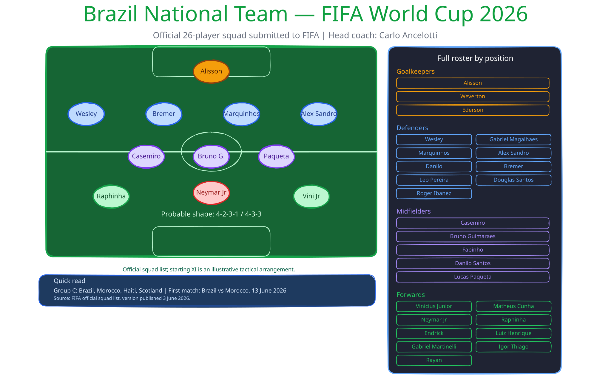

# Codex Excalidraw Skill

An original Codex skill for generating, previewing, sharing and iterating editable Excalidraw diagrams from natural-language requests or compact JSON specs.

This project turns diagram prompts into real `.excalidraw` scene files, not static screenshots. The generated diagrams can be opened in Excalidraw, edited manually, shared as web links and reused for follow-up changes.

## Why This Exists

Many AI diagram workflows stop at a rendered image. That is useful for a preview, but weak for real work: teams usually need to edit labels, move boxes, adjust layouts and keep improving the same visual.

This skill explores a more practical workflow:

- generate structured Excalidraw JSON
- create SVG and HTML previews for quick review
- optionally produce ready-to-open Excalidraw Web links
- keep local session state so follow-up requests can edit the previous diagram
- use specialized templates when a generic boxes-and-arrows diagram is not enough

## Example Output

Editable tactical roster diagram generated by the skill:



The preview above is an SVG export. The source is structured Excalidraw data, so the scene can still be opened and edited.

## Capabilities

- Create editable `.excalidraw` diagrams from JSON specs.
- Generate chat-friendly SVG previews.
- Generate local HTML preview pages with an **Open in Excalidraw** button.
- Upload encrypted scenes to Excalidraw Web when a ready web link is needed.
- Support local-only output with `--no-web-link`.
- Persist the latest diagram locally for incremental edits.
- Provide specialized generators for:
  - node-and-edge diagrams
  - web-link handoff diagrams
  - tactical football roster diagrams
  - landmark/building elevation diagrams

## Repository Structure

```text
codex-excalidraw-skill/
  skill/
    SKILL.md
    scripts/
    references/
    agents/
  examples/
  specs/
  notes/
  README.md
```

- `skill/`: installable Codex skill source.
- `skill/scripts/`: diagram generators, validators, preview builders and state helpers.
- `skill/references/`: Excalidraw format notes, authoring rules and quality gates.
- `examples/`: generated outputs worth keeping as reference.
- `specs/`: reusable JSON specs for diagram generation.
- `notes/`: design decisions and future template ideas.

## Quick Start

Clone the repository:

```bash
git clone https://github.com/fabricioartur/codex-excalidraw-skill.git
cd codex-excalidraw-skill
```

Install the skill into Codex:

```bash
mkdir -p ~/.codex/skills/excalidraw
rsync -a --delete ./skill/ ~/.codex/skills/excalidraw/
```

Create a simple diagram from a spec:

```bash
python3 skill/scripts/generate_excalidraw.py \
  specs/checkout-flow.json \
  /private/tmp/example.excalidraw \
  --preview
```

Create a temporary web handoff:

```bash
python3 skill/scripts/create_web_diagram.py \
  specs/checkout-flow.json \
  --name example-diagram
```

For local-only output without uploading to Excalidraw Web:

```bash
python3 skill/scripts/create_web_diagram.py \
  specs/checkout-flow.json \
  --name example-diagram \
  --no-web-link
```

Run the specialized building elevation example:

```bash
python3 skill/scripts/create_building_elevation.py \
  specs/empire-state-building.json \
  --name empire-state
```

## Minimal Diagram Spec

```json
{
  "title": "Checkout Flow",
  "direction": "LR",
  "nodes": [
    {"id": "buyer", "label": "Buyer"},
    {"id": "storefront", "label": "Storefront"},
    {"id": "payment", "label": "Payment API"}
  ],
  "edges": [
    {"from": "buyer", "to": "storefront", "label": "Selects item"},
    {"from": "storefront", "to": "payment", "label": "Authorizes"}
  ]
}
```

Supported fields include:

- `title`: optional diagram title.
- `direction`: `LR` or `TB`.
- `nodes`: list of diagram nodes with `id` and `label`.
- `edges`: list of directional connections.
- `groups`: optional grouped sections around related nodes.

## Validation

Validate generated scenes before sharing:

```bash
python3 skill/scripts/validate_scene.py /path/to/diagram.excalidraw
```

The validator checks for common quality issues such as malformed scene structure, duplicate IDs, invisible elements and unreadable text.

## Privacy Notes

By default, the web-link workflow uploads an encrypted, compressed copy of the diagram to Excalidraw's JSON storage and returns a URL that includes the decryption key in the fragment.

Use `--no-web-link` when the diagram should remain local-only.

## Design Principles

- Prefer editable diagrams over static images.
- Preserve layout and element IDs during follow-up edits when practical.
- Use templates for specialized visual compositions instead of forcing every request into generic boxes and arrows.
- Optimize for readability at preview size.
- Keep local runtime state out of version control.

## Project Status

This is an active personal skill experiment focused on practical Codex workflows, diagram automation and editable AI-generated visuals.

Useful next improvements:

- package the scripts with a small CLI entrypoint
- add automated tests for the scene generators
- expand reusable templates for architecture and workshop diagrams
- add more example specs and preview outputs

## Authorship

Created and maintained by **Fabricio Artur**.

This is an original implementation designed through hands-on iteration inside Codex.
